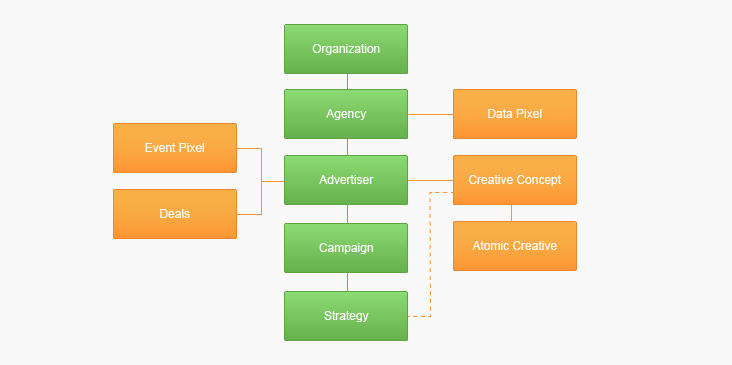

# Documentation

- [Installing the SDK](installation.md)
- [Using the SDK](Usage/usage.md)
- [Customising the SDK](Customising/customising.md)
- [SDK Class Reference](ClassReference/README.md)
- [Cookbook Recipes](Cookbook/README.md)

### API Object hierarchy

